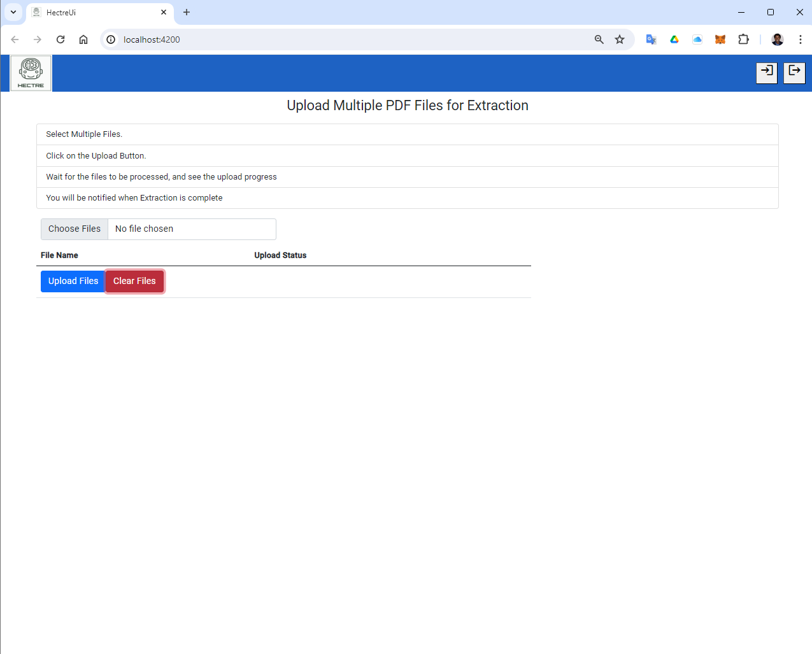
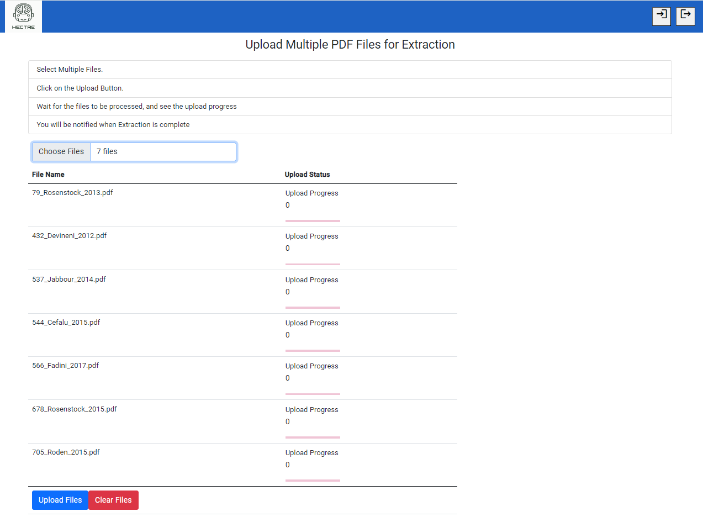
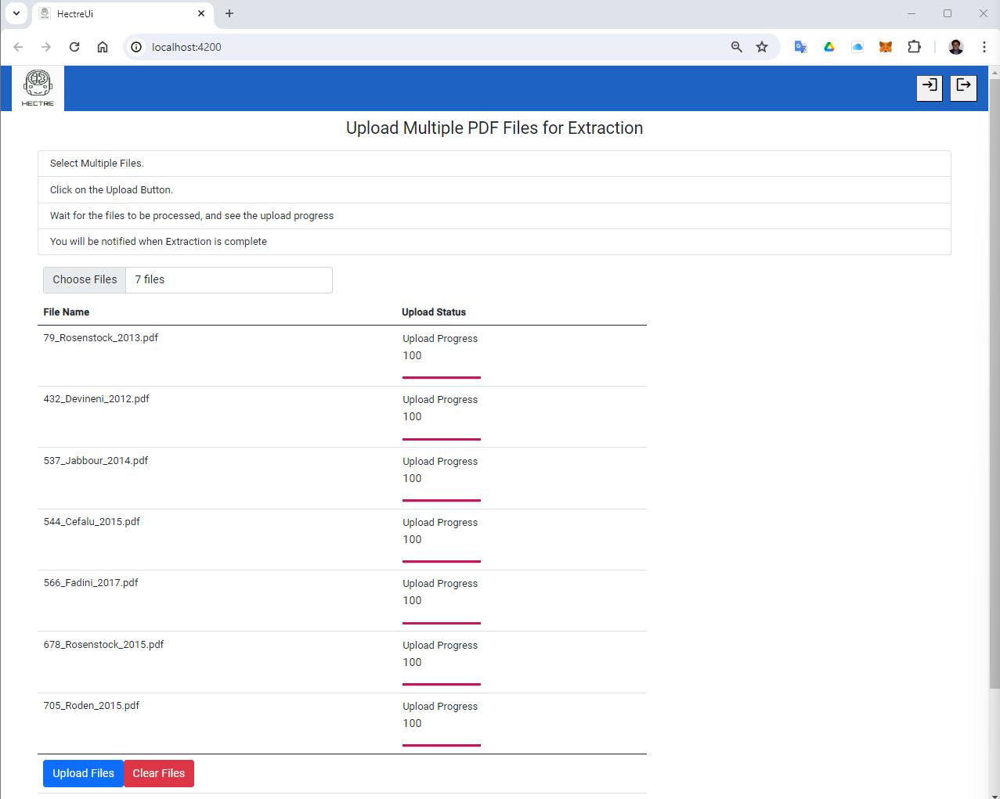
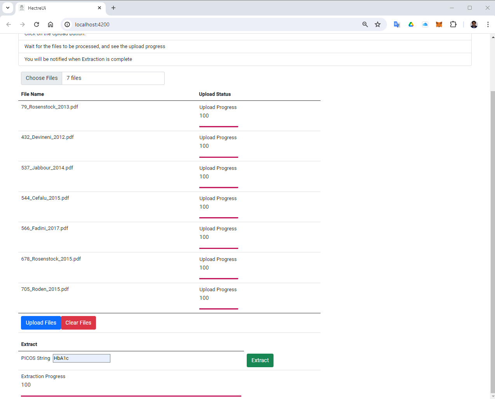
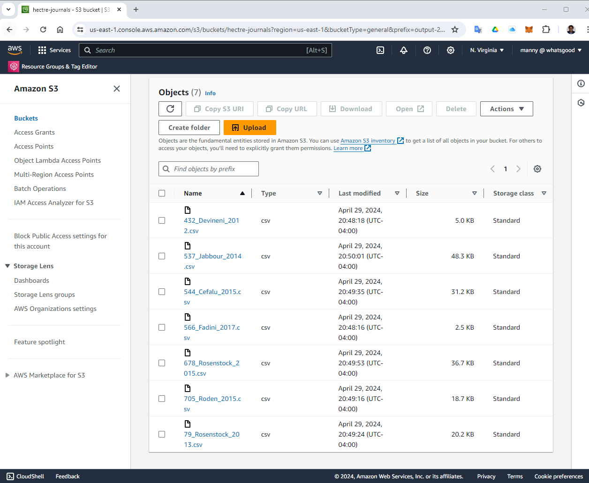

# HECTRE User Guide
Read this only after the tool has been setup properly. If not, [click here for the setup guide.](/README.md)

## Perform Extraction on the Command Line
```bash
make extract path=[FILE OR FOLDER OR URL] picos=[ENDPOINTS SEPARATED BY SEMICOLON]
```

Simple example:
```bash
make extract file="79_Rosenstock_2013.pdf" picos="HbA1c"
```

Passing in many different outcomes:
```bash
make extract file="305_deBruin_2018.pdf" picos="EASI 50;EASI 75;EASI 90;EASI;SCORAD"
```

Extracting from every PDF in a folder, with the same outcome(s):
```bash
make extract file="folder/pdfs/" picos="HbA1c"
```

Extracting from an URL:
```bash
make extract file="https://eprints.whiterose.ac.uk/125021/8/Bruin-Weller_et_al-2018-British_Journal_of_Dermatology.pdf" picos="EASI 75"
```

Outputs will be saved in `/output/*.csv`, with the file name set to the time when extraction has finished.

## Perform Extractions on the Web UI

### Run the application

**Note**: Make sure to place a .env file in the docker directory with AWS credentials. Or have the credentials set in ~/.aws/credentials. 
</br>

Example ./docker/.env file:

```bash
aws_access_key_id=some_access_key_id
aws_secret_access_key=some_secret_access_key
```

```bash
# If using docker
make compose

# If running backend and frontend separately
make be-dev
make ui-dev
```

### Access the application

Open your browser and go to `http://localhost:4200/`



Select files for extraction



Click upload button and watch for upload progress



After upload, the outcomes field and extract button will appear. </br>
Fill in the outcomes usind a semicolon seperated string. </br>
And click extract to start the extraction process.



Extracted files are available for download in s3

